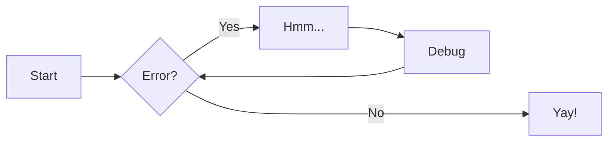

# examples
## Text Formatting 

You can have lists like this

- first
- second
- third

Or checklist lists to

- [ ] ==Get==
- [ ] things
- [ ] ~~done~~

Also, get highlights and strikethroughs as above (similar to Obsidian).


More formatting options for your webpage [here](https://squidfunk.github.io/mkdocs-material/reference/formatting/#highlighting-changes). (but not compatible with Obsidian)

> [!note]
> callout tests

> [!tip]
> tips

test html callout:
<div class="admonition note">
    <p class="admonition-title">Note</p>
<p>test</p>
</div>

link test:

[/wiki](/wiki)

[wiki/code/archinstall](/wiki/code/archinstall) this seems works

 use this one
## Mermaid diagrams

Here's the example from [MkDocs Material documentation](https://squidfunk.github.io/mkdocs-material/reference/diagrams/#using-flowcharts): 



## LaTeX Math Support

LaTeX math is supported using MathJax.

Inline math looks like $f(x) = x^2$. The input for this is `$f(x) = x^2$`. Use `$...$`.

For a block of math, use `$$...$$` on separate lines

```
$$
F(x) = \int^a_b \frac{1}{2}x^4
$$
```

gives 

$$
F(x) = \int^a_b \frac{1}{2}x^4
$$
