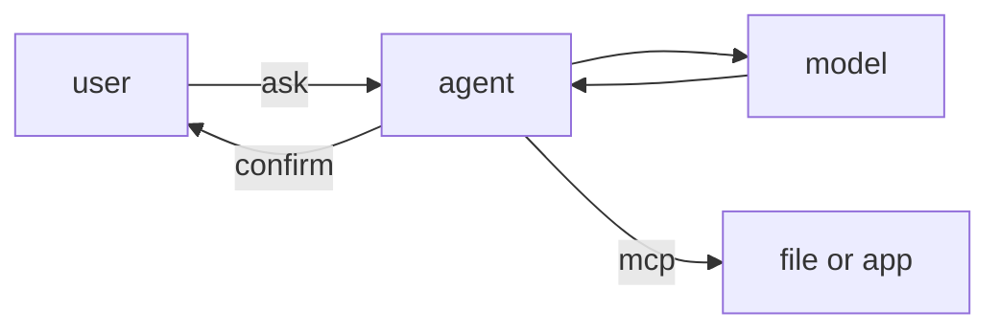

# AI

这里是一些AI相关的信息。

## overview

用户与`agent`通讯，`agent`与对话大模型通讯，反复对话；根据大模型的回答使用读写等功能处理文件或其他。`mcp`提供读写操作其他文件或程序的协议。

## AI模型

### 网页 chat

### api使用

### 本地

ollama

## coding

### 编辑器

- [nvim](/wiki/dev/ai/ai-in-nvim)
- vscode

### 用例

## 客户端、服务、集成

- mcp
- web
- desktop
