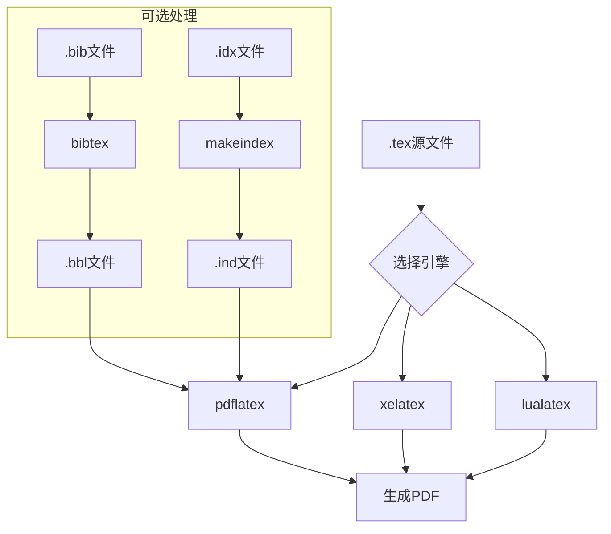

# latex概览

## tex 和 latex

### **1. TeX：底层排版引擎**

- **作者**：Donald Knuth（高德纳）开发，1978 年发布。
- **定位**：
    - 是一个**底层的排版编程语言**，提供精确的排版控制（如盒模型、断行算法、数学公式布局等）。
    - 语法类似编程（需手动处理格式细节），适合专业人士或极客。
- **特点**：
    - 直接操作命令（如 `\hbox`, `\vskip`）。
    - 默认生成 `.dvi` 文件（需转换为 PDF/PS）。
    - 无预定义的高层结构（如章节、目录需手动实现）。

**示例（纯 TeX 代码）**：

```tex
\font\myfont=cmr12 at 14pt
\myfont Hello, \TeX!
\bye
```

### **2. LaTeX：基于 TeX 的高级封装**

- **作者**：Leslie Lamport（莱斯利·兰波特）开发，1984 年发布。
- **定位**：
    - 是 **TeX 的宏包集合**（一组预定义的命令和模板），提供**文档逻辑结构**（如章节、参考文献、交叉引用）。
    - 隐藏了 TeX 的底层复杂性，用户只需关注内容。
- **特点**：
    - 提供标准文档类（如 `article`, `book`）。
    - 内置自动化功能（目录、编号、参考文献管理）。
    - 依赖宏包扩展功能（如 `graphicx` 插入图片、`amsmath` 增强数学公式）。

**示例（LaTeX 代码）**：

```tex
\documentclass{article}
\begin{document}
\section{Introduction}
Hello, \LaTeX!
\end{document}
```

### **核心区别**

| 特性           | TeX                  | LaTeX                          |
| -------------- | -------------------- | ------------------------------ |
| **设计目标**   | 底层排版控制         | 高层文档结构                   |
| **语法复杂度** | 复杂（类似编程）     | 简单（声明式）                 |
| **典型用户**   | 排版系统开发者、极客 | 学术作者、普通用户             |
| **扩展性**     | 需手动实现一切       | 通过宏包（如 `hyperref`）扩展  |
| **默认输出**   | `.dvi`               | `.dvi` 或 `.pdf`（现代工具链） |

### **类比解释**

- **TeX 类似汇编语言**：
    - 直接控制硬件（排版细节），但编写复杂。
- **LaTeX 类似高级语言（如 Python）**：
    - 通过抽象（如 `\section`）隐藏细节，提升效率。

### **技术关系**

- LaTeX 本质是一组 TeX 宏（`.sty` 文件），最终仍由 TeX 引擎（如 `pdftex`, `xetex`, `luatex`）执行。
- 编译流程示例：
    ```sh
    latex document.tex   # 调用 pdftex 引擎处理 LaTeX 宏
    xelatex document.tex # 调用 xetex 引擎处理 LaTeX 宏
    ```

### **总结**

- **TeX 是引擎，LaTeX 是模板**。
- LaTeX 让用户摆脱 TeX 的底层复杂性，专注于内容逻辑。
- 现代用户通常直接使用 `pdflatex`/`xelatex`/`lualatex`，无需接触原始 TeX 命令。

如果需要进一步解释某个具体细节（如宏包机制或引擎差异），可以继续讨论！

## 引擎和使用

### **1. 排版引擎（Engines）**

引擎是实际执行排版工作的底层程序，负责解析代码、计算布局并生成输出文件（如 PDF/DVI）。  
**属于引擎的有**：

- `tex`：Knuth 原始 TeX 引擎（生成 `.dvi`）。
- `pdftex`：扩展的 TeX 引擎，直接生成 PDF（`pdflatex` 的基础）。
- `xetex`（XeTeX）：支持 Unicode 和系统字体的引擎（`xelatex` 的基础）。
- `luatex`（LuaTeX）：内嵌 Lua 脚本的引擎（`lualatex` 的基础）。

### **2. 模板/格式（Formats）**

格式是基于引擎的预定义命令集合（宏包），提供高层抽象，简化用户操作。  
**属于格式的有**：

- `latex`：LaTeX 格式（运行在 `pdftex`/`xetex`/`luatex` 等引擎上）。
    - 不是独立引擎，而是通过 `latex` 命令调用引擎（如 `pdftex + LaTeX 宏` → `pdflatex`）。
- `plain tex`：Knuth 提供的极简格式（比原始 TeX 稍友好，但远不如 LaTeX）。
- `contex`：另一种高级格式（基于 LuaTeX，适合复杂排版）。

### **3. 前端命令（Frontends）**

用户直接调用的命令，本质是 **“引擎 + 格式” 的组合**：
| 命令 | 实际调用 | 说明 |
|------------|-------------------------|-------------------------------|
| `latex` | `pdftex + LaTeX 格式` | 传统 LaTeX（DVI 输出）。 |
| `pdflatex` | `pdftex + LaTeX 格式` | 直接生成 PDF（无 Unicode 支持）。|
| `xelatex` | `xetex + LaTeX 格式` | 支持 Unicode 和系统字体。 |
| `lualatex` | `luatex + LaTeX 格式` | 支持 Lua 脚本和现代字体。 |

### **关键区分**

- **引擎**：`tex`, `pdftex`, `xetex`, `luatex`（核心执行者）。
- **格式**：`latex`, `plain tex`, `contex`（定义高级命令的规则）。
- **前端命令**：`latex`, `pdflatex`, `xelatex`, `lualatex`（组合引擎和格式的快捷方式）。

### **常见误解澄清**

1. **`latex` 不是引擎**：
    - 它是 LaTeX 格式通过 `pdftex` 引擎运行的接口（命令）。
2. **`pdflatex` vs `pdftex`**：
    - `pdftex` 是引擎，`pdflatex` = `pdftex` + LaTeX 格式。

---

## 引擎（Engines）

### 基础引擎

| 引擎名称            | 特点                    | 输出格式  | 主要用途                 |
| ------------------- | ----------------------- | --------- | ------------------------ |
| **tex**             | Knuth原始引擎，底层控制 | .dvi      | 历史兼容、底层排版开发   |
| **pdftex**          | TeX的扩展，直接PDF输出  | .pdf      | 传统LaTeX文档排版        |
| **xetex** (XeTeX)   | 支持Unicode和系统字体   | .xdv/.pdf | 多语言排版、系统字体支持 |
| **luatex** (LuaTeX) | 内嵌Lua解释器，动态脚本 | .pdf      | 复杂排版、自动化处理     |

### 引擎特性对比

| 特性         | tex | pdftex | xetex   | luatex |
| ------------ | --- | ------ | ------- | ------ |
| Unicode支持  | ❌  | ❌     | ✔️      | ✔️     |
| OpenType字体 | ❌  | ❌     | ✔️      | ✔️     |
| Lua脚本      | ❌  | ❌     | ❌      | ✔️     |
| 系统字体     | ❌  | ❌     | ✔️      | ✔️     |
| 输出格式     | DVI | PDF    | XDV/PDF | PDF    |

## 格式（Formats）

### 主要格式

| 格式名称      | 基于引擎 | 特点                   | 适用场景                 |
| ------------- | -------- | ---------------------- | ------------------------ |
| **plain tex** | tex      | Knuth提供的极简格式    | 底层TeX编程              |
| **latex**     | 多引擎   | 高级文档结构，宏包丰富 | 学术论文、书籍、报告     |
| **contex**    | luatex   | 模块化设计，强大功能   | 复杂排版、图形密集型文档 |

## 前端命令（Frontend Commands）

### 常用命令组合

| 命令       | 实际组成           | 输出格式 | 特点              |
| ---------- | ------------------ | -------- | ----------------- |
| `tex`      | tex + plain tex    | .dvi     | 原始TeX排版       |
| `latex`    | pdftex + latex格式 | .dvi     | 传统LaTeX处理     |
| `pdflatex` | pdftex + latex格式 | .pdf     | 直接PDF输出       |
| `xelatex`  | xetex + latex格式  | .pdf     | Unicode和字体支持 |
| `lualatex` | luatex + latex格式 | .pdf     | Lua脚本+现代特性  |

## 文件格式

### 输入文件类型

| 扩展名 | 类型     | 说明             |
| ------ | -------- | ---------------- |
| `.tex` | 源文件   | TeX/LaTeX源代码  |
| `.sty` | 宏包文件 | LaTeX功能扩展包  |
| `.cls` | 文档类   | 文档类型定义     |
| `.bib` | 参考文献 | BibTeX数据库文件 |

### 输出文件类型

| 扩展名 | 生成工具                  | 说明         |
| ------ | ------------------------- | ------------ |
| `.dvi` | tex/latex                 | 设备无关文件 |
| `.pdf` | pdflatex/xelatex/lualatex | 便携文档格式 |
| `.xdv` | xetex                     | 扩展DVI格式  |
| `.aux` | 所有引擎                  | 辅助信息文件 |
| `.log` | 所有引擎                  | 编译日志文件 |

## 工具链组件

### 核心工具

| 工具名称      | 用途         | 示例               |
| ------------- | ------------ | ------------------ |
| **texlua**    | Lua解释器    | 运行TeX相关Lua脚本 |
| **kpsewhich** | 文件查找     | 定位TeX文件位置    |
| **bibtex**    | 参考文献处理 | 生成参考文献列表   |
| **makeindex** | 索引生成     | 创建文档索引       |

### 编译工具链



## 选择指南

### 引擎选择建议

1. **中文/多语言文档**：`xelatex` 或 `lualatex`
2. **传统英文文档**：`pdflatex`
3. **需要动态功能**：`lualatex`（Lua脚本）
4. **底层开发**：`tex` 或 `luatex`

## 列举


### **1. `tex`（原始 TeX 引擎）**

- **作用**：Knuth 开发的原始 TeX 排版引擎，处理 `.tex` 文件并生成 `.dvi`（DeVice Independent）文件。
- **特点**：
    - 仅支持传统的 TeX 命令，不支持现代字体（如 OpenType）。
    - 主要用于历史兼容性或极简排版。
- **使用示例**：
    ```sh
    tex mydocument.tex  # 生成 mydocument.dvi
    ```

### **2. `latex`（LaTeX 格式 + pdfTeX 引擎）**

- **作用**：使用 `pdftex` 引擎处理 LaTeX 文档（`.tex`），默认生成 PDF（也可生成 DVI）。
- **特点**：
    - 基于 `pdftex`，支持 PDF 输出、微调排版和基本字体扩展。
    - 但不支持 Unicode 和 OpenType 字体（需额外宏包如 `fontspec`）。
- **使用示例**：
    ```sh
    latex mydocument.tex  # 生成 mydocument.dvi
    pdflatex mydocument.tex  # 生成 mydocument.pdf
    ```


### **3. `xetex`（XeTeX 引擎，支持 Unicode 和系统字体）**

- **作用**：TeX 引擎，原生支持 Unicode 和系统字体（如 `.ttf`/`.otf`）。
- **特点**：
    - 直接调用系统字体，无需额外配置。
    - 适用于多语言排版（如中文、阿拉伯语）。
    - 输出格式为 `.xdv`（扩展 DVI），通常转换为 PDF。
- **使用示例**：
    ```sh
    xetex mydocument.tex  # 生成 mydocument.xdv（通常自动转 PDF）
    ```


### **4. `xelatex`（LaTeX + XeTeX 引擎）**

- **作用**：`latex` 的增强版，使用 `xetex` 引擎处理 LaTeX 文档，支持现代字体。
- **特点**：
    - 支持 `fontspec` 宏包，可轻松使用系统字体。
    - 适合中文排版（如配合 `ctex` 宏包）。
- **使用示例**：
    ```sh
    xelatex mydocument.tex  # 直接生成 PDF
    ```


### **5. `luatex`（LuaTeX 引擎，支持 Lua 脚本）**

- **作用**：扩展的 TeX 引擎，内置 Lua 解释器，允许动态脚本控制排版。
- **特点**：
    - 支持 Unicode 和 OpenType 字体（类似 XeTeX）。
    - 可通过 `\directlua{}` 嵌入 Lua 代码，实现高级自动化。
    - 默认生成 PDF。
- **使用示例**：
    ```sh
    luatex mydocument.tex  # 生成 PDF
    ```


### **6. `lualatex`（LaTeX + LuaTeX 引擎）**

- **作用**：`latex` 的现代替代品，使用 `luatex` 引擎，结合 LaTeX 和 Lua 扩展。
- **特点**：
    - 支持 `fontspec` 和 Lua 脚本，灵活性极高。
    - 适合复杂排版（如自动生成内容、动态调整格式）。
- **使用示例**：
    ```sh
    lualatex mydocument.tex  # 生成 PDF
    ```


### **总结对比**

| 命令       | 引擎   | 输出格式 | Unicode 支持 | OpenType 支持 | Lua 支持 | 典型用途               |
| ---------- | ------ | -------- | ------------ | ------------- | -------- | ---------------------- |
| `tex`      | TeX    | DVI      | ❌           | ❌            | ❌       | 原始 TeX 排版          |
| `latex`    | pdfTeX | DVI/PDF  | ❌           | ❌            | ❌       | 传统 LaTeX 文档        |
| `pdflatex` | pdfTeX | PDF      | ❌           | ❌            | ❌       | 直接生成 PDF           |
| `xetex`    | XeTeX  | XDV/PDF  | ✔️           | ✔️            | ❌       | 多语言排版（系统字体） |
| `xelatex`  | XeTeX  | PDF      | ✔️           | ✔️            | ❌       | 现代 LaTeX（中文友好） |
| `luatex`   | LuaTeX | PDF      | ✔️           | ✔️            | ✔️       | 动态脚本控制排版       |
| `lualatex` | LuaTeX | PDF      | ✔️           | ✔️            | ✔️       | 高级 LaTeX 自动化      |
