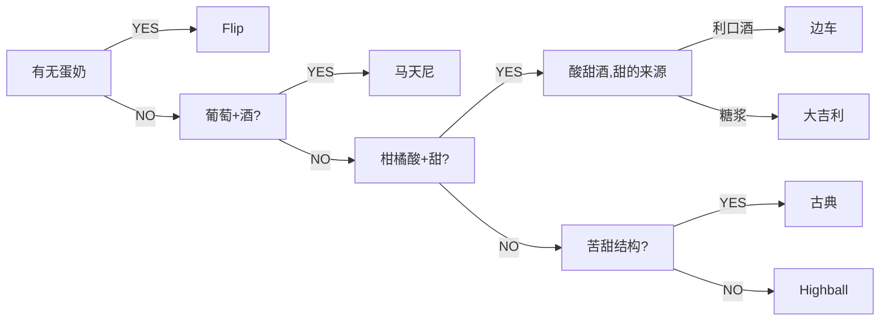

# Cocktail

> [!important] **Drink properly**

关于鸡尾酒的小知识

## 理论部分

《鸡尾酒法典》将所有调酒分为6个框架，即所有无论是多么花里胡哨的酒都是建立在该种基础上的。

1. `old fashioned` 即古典类鸡尾酒，这个古典鸡尾酒曾是所有鸡尾酒的代名词，在19世纪初鸡尾酒刚出现时，由于当时的烈酒酿造工艺远没有现代化工业的精细，导致烈酒里会存在很多令人所不悦的味道，所以人们就开始尝试在酒里加料来改变改善烈酒在入口时的口感和味道。公式为 烈酒+糖+香料+水（冰）（各式）=old fashioned古典类调酒。附上old fashioned鸡尾酒配方。威士忌60ml+方糖+苦精三滴（甩）+少量苏打水融化方糖一颗或者10ml左右糖浆（自行控制喜欢的甜度）+柑橘皮随着酒液碾碎方糖释放香气+冰块+柑橘皮油喷香
2. `high ball`
   类鸡尾酒 即高球也称嗨棒。由一份烈酒来提供核心风味，搭配两份的长饮部分来平衡酒体，这是让酒变得简单好喝的直接途径，当然你一比一一比五都无所谓，投其所好即可。金酒加汤力水就是金汤力鸡尾酒，金酒加柠檬汁加糖浆加苏打水就是金菲士（gin fizz）。白兰地加姜汁汽水或者姜汁汤力水就是马脖子鸡尾酒（加姜汁汽水版本无敌好喝）。威士忌加苏打水就是典中典high ball鸡尾酒本身。high ball这类酒可以延续酒的风味，长饮部分是一个很广阔的概念，基本所有饮料都可以作为长饮部分，可乐，红牛，橙汁，甚至冰水都可以作为长饮部分来构成鸡尾酒。常见的威士忌可乐，橙汁加伏特加的螺丝起子鸡尾酒，水割（威士忌加水）都属于high ball长饮类型鸡尾酒。公式 烈酒+长饮成分=high ball类鸡尾酒
3. `Daiquiri大吉利`类鸡尾酒，一类非常简单框架的鸡尾酒 公式就是烈酒+柑橘酸+糖。大吉利鸡尾酒配方 75ml的朗姆+30ml的青柠汁+15ml糖浆，酸甜度自己平衡就行了，不以我这个为标准。这是一个很简单的结构，但是你可以凭借这个结构看懂很多酒单，只要改变烈酒种类就可以衍生出很多鸡尾酒变种。上文朗姆改成金酒就是琴蕾鸡尾酒。朗姆改成威士忌就是威士忌酸。此类调酒多用shake调制法，但是不能太多冰块和过长的调和，会破坏烈酒原来的风味并加快冰块融化以致鸡尾酒太过于水
4. `side car边车`。这和上面的大吉利结构差不多，就是把上文的糖浆改为利口酒。经典边车鸡尾酒 45ml的干邑白兰地+30ml的柠檬汁+30ml君度橙味利口酒，此时的酒精量以白兰地和利口酒一起不补足，利口酒也会提供一个甜的口感，与柠檬汁平衡酸甜。以上的边车和大吉利类鸡尾酒统称为 sweet—sour drink的酸甜酒。是一种酸酸甜甜喝起来很轻松的鸡尾酒
5. `Martin马天尼` 公式也是很简单 烈酒+加香葡萄Martin 干马天尼是一个非常需要控住化水量的酒，一旦水化的比较多会破坏酒体，保持一个30°以上的酒精度，出水太少则酒体过为强烈导致不好入口。接受不了太高太强烈的酒体？那就将烈酒部分降低，用味美思以及甜甜附带各种风味的利口酒来补足
6. `Flip`公式为烈酒+蛋/奶+糖。它的主要结构是烈酒或者是葡萄酒，加上蛋或者奶这样比较浓厚的配料，再加上糖平衡酒体。此类酒较少所以简单举一个干邑flip的例子：45ml的干邑白兰地+一颗无菌蛋+10ml的糖浆，用搅拌器或者弹簧将鸡蛋打发（电动搅拌器大约5分钟，弹簧我懒得试），接着加入冰块shake，要注意将冰块shake的时间加长让化水丰富，酒体充分加入空气让其喝起来更加绵密，像一个甜品一样

例如：

- `Old fashioned古典`烈酒+糖+苦精 例：各种基底（威士忌、干邑、白酒等等）的old fashioned、萨泽拉克sazerac、薄荷茱利普Julip
- `Highball`烈酒+两份长饮成分 例：金汤力、帕洛玛Paloma、自由古巴、大多数便利店调酒
- `Daiquiri大吉利`烈酒+柑橘酸+糖浆 例：Gimlet、威士忌酸、Fizz类
- `Sidecar边车` 烈酒+柑橘酸+利口酒 例：White lady、玛格丽特
- `Martini马天尼`烈酒+加香葡萄酒 例：曼哈顿、Rob roy罗布罗伊、Vesper、Negroni
- `Flip`烈酒+蛋/奶+糖 例：亚历山大、白俄罗斯

一个简单的类型判断：

## 酒单

### 典中典

首先是按照分类的一些非常经典的酒：

> [!note]- 酸甜酒
>
> - Whitelady
> - Gimlet
> - Daiquiri
> - xyz
> - 神风特工队
> - 大都会
> - Side Car
> - Between sheets
> - Margaret
> - Whiskey Sour

> [!note] Highball
>
> - Gin & Tonic
> - Gin Fizz
> - Cuba libre 自由古巴
> - Mojito
> - Bloody Mary 血腥玛丽
> - Screw Driver
> - Horse's neck
> - El Diablo
> - Whiskey Highball

> [!note]
>
> - Martini
> - Negroni
> - Manhattan
> - Vesper

> [!note] Old Fashion
>
> - Old Fashioned
> - Old pal
> - 老广场
> - 萨泽拉克

### 好喝的经典

- 罗西塔

## 酒谱

### 好学好做的

**酸甜酒：**

|                    | 基酒             | 酸       | 甜        | 利口酒        | 其他 |
| ------------------ | ---------------- | -------- | --------- | ------------- | ---- |
| Kamikaze           | Vodka 30         | lime 30  |           | Triple Sec 30 |      |
| Whitelady          | Gin 60           | lemon 15 |           | Triple Sec 15 |      |
| Gimlet             | Gin 45           | lime 30  | simple 15 |               |      |
| Daiquiri           | Rum 45           | lime 15  | simple 10 |               |      |
| xyz                | Rum 30           | lime 15  |           | Triple Sec 15 |      |
| Side Car           | Brandy 60        | lemon 15 |           | Triple Sec 30 |      |
| Between the sheets | Brandy 30 Rum 30 | lime 15  |           | Triple Sec 30 |      |
| Whisky sour        | whisky 60        | lime 20  | rich 15   |               | egg  |

**Highball类长饮：**

|              | 基酒   | 长饮成份    | 其他         |
| ------------ | ------ | ----------- | ------------ |
| Screw Driver | vodka  | 橙汁        |              |
| Moscow Mule  | vodka  | Ginger beer | lime         |
| Gin & Tonic  | Gin    | Tonic       | lime         |
| Gin Fizz     | Gin    | Soda        | sugar, lemon |
| Pina colada  | Rum    | pineapple   | 椰汁         |
| Mojito       | Rum    | soda        | mint, lime   |
| Cuba Libre   | Rum    | coca        | lime         |
| Horse's neck | Brandy | Ginger beer | orange peel  |
| Highball     | whisky | Soda        | Ginger beer  |
| Whisky coca  | whisky | coca        |              |
